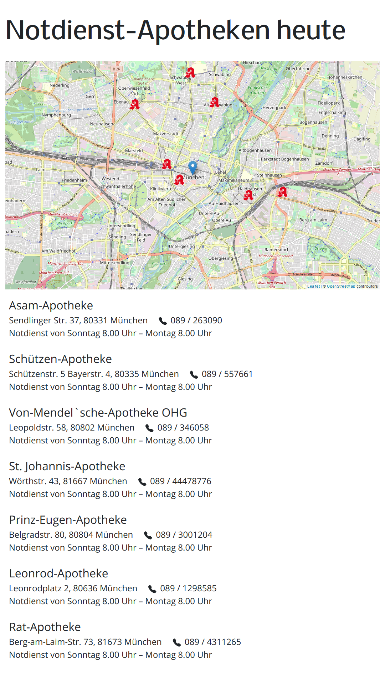

# Apothekennotdienst

Application to display emergency pharmacy service information.

A pharmacy in Germany is legally required to display at least 2 other nearby pharmacies which are in-service if the pharmacy is closed.

This app displays this information along with the location of the other nearby pharmacies on a map.



## System setup

The pharmacy uses a cheap LCD monitor in its store window.
A Raspberry PI Zero W is connected to this monitor.
A Chromium browser runs in kiosk mode and displays a web site.
This web site is a React app which periodically requests the nearby pharmacies which are in service from a backend.
The backend is implemented as a serverless function, hosted together with the static assets of the web site on Netlify.
The serverless function accesses the data from a PostgreSQL database hosted in the cloud.

## Installation

### PostgreSQL database

You need a PostgreSQL database in the cloud for storing the data.
[ElephantSQL](https://www.elephantsql.com/) provides a PostgreSQL database "as a service".
The free "Tiny Turtle" version is sufficient for this application.

Create an instance and copy your database URL for later use.

Execute the following SQL queries to create your schema:

```sql
create table if not exists pharmacies (
	"name" text not null,
	phone text,
	street text not null,
	postalcode text not null,
	city text not null,
	loc point,
	primary key(name, city),
	unique (name, city)
);
create index on pharmacies using gist(loc);
create table if not exists services (
	"name" text not null,
	city text not null,
	"start" timestamp with time zone,
	"end" timestamp with time zone,
	foreign key ("name", city) references pharmacies ("name", city),
	unique ("name", city, "start", "end")
);
```

Fill those tables with the appropriate data on the pharmacies (geolocation) and emergency services.

The method how to fill this table depends on the respective "Landesapothekerkammer".
Some provide information in XML format, others only provide web pages or PDF documents.

### Local installation of the React/TypeScript development environment

Set the environment variable POSTGRESQL_URL to the URL (including username and password) of your PostgreSQL database.
This can be provided using a file `.env`.

```sh
yarn
yarn build
yarn start
```

Your local application is then running at http://localhost:3000.
In order to select the correct pharmacy and city, you have to provide these using query parameters:
http://localhost:3000?name=XYZ-Apotheke&city=Musterstadt

### Netlify configuration

- Build & deploy
  - Build settings
    - Repository: github.com/TimGeisler/apothekennotdienst (or your clone)
    - Build command: yarn build
    - Publish directory: build
    - Builds: Active
  - Deploy contexts
    - Production branch: main
    - Deploy only the production branch
  - Environment variables
    - POSTGRESQL_URL: set to the URL of your database

### Hardware in the Pharmacy

- LCD Monitor

As an LCD monitor we use a Philips 243B9 https://www.philips.de/c-p/243B9_00/lcd-monitor-mit-usb-c-anschluss
which can be rotated by 90° to allow a portrait display of the emergency-service plan
and provides sufficient power to run a Raspberry PI Zero.

- Raspberri PI Zero W

To run a web browser in kiosk mode to display the emergency pharmacy service information,
a Raspberry PI Zero W is sufficient.

- Cables

    - micro USB cable to connect the Raspberry PI (micro-B plug) to the monitor (either USB-C or USB-A) is required.

    - mini HDMI cable to conect the Raspberry PI (mini HDMI plug) to the monitor (HDMB)

- SD card

### Raspberry PI Zero W configuration

- HDMI configuration (sufficient power, display rotation)
- autostart Chromium with web page in kiosk mode
- use the Netlify app url
- no screen saver
- WLAN setup
